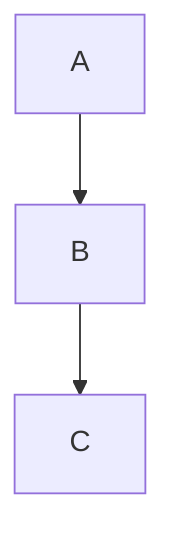

# website

Personal blog built with Hugo + PaperMod, hosted on GitHub Pages, managed via Pages CMS.

## Stack

- **Hugo** — static site generator
- **PaperMod** — theme (git submodule)
- **GitHub Actions** — build and deploy on push to `main`
- **GitHub Pages** — hosting (served from `gh-pages` branch)
- **Pages CMS** — web-based content editor (SaaS, no self-hosting needed)

## Local setup

**Prerequisites:** Hugo extended (`brew install hugo`)

```bash
git clone --recurse-submodules git@github-personal:lorenzogirardi/website.git
cd website
hugo server -D
```

Site available at `http://localhost:1313/website/`

## Write a post

### Via Pages CMS (recommended)

1. Go to [app.pagescms.org](https://app.pagescms.org)
2. Sign in with GitHub
3. Select repo `lorenzogirardi/website`
4. Posts → New entry → write → **Save**
5. GitHub Actions builds and deploys automatically (~1 min)

### Via git

```bash
# create post file
cat > content/posts/my-post.md << 'EOF'
---
title: "My Post"
date: 2026-05-24
draft: false
tags: ["tag"]
description: "Short description."
---

Post content here.
EOF

git add content/posts/my-post.md
git commit -m "post: my post title"
git push origin main
```

## Mermaid diagrams

Supported natively. Use standard fenced code blocks:

````markdown

````

Implemented via:
- `layouts/_default/_markup/render-codeblock-mermaid.html` — render hook wraps block in `<pre class="mermaid">`
- `layouts/partials/extend_footer.html` — loads Mermaid JS from CDN on every page

## Deploy

Push to `main` triggers GitHub Actions automatically:

```
main push → Hugo build → deploy to gh-pages branch → live at https://lorenzogirardi.github.io/website/
```

## Branches

| Branch | Purpose |
|--------|---------|
| `main` | Source — edit here |
| `gh-pages` | Built HTML — auto-generated, never edit manually |
