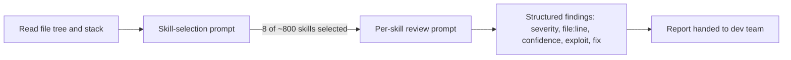
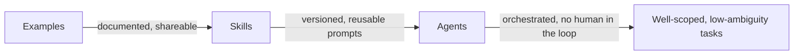

### Table of Contents

  * The 2008 Analogy
  * Introduction
  * One Project, Three Reports
  * How the Numbers Were Collected
  * What the Development Spend Actually Shows
    * Cache Economics: the Real Story Isn't the Bill
    * The CI/CD Question
  * The Security Review: Findings vs Judgment
    * The Approach
    * Eight Findings, Three Fixed, Five Documented
    * "Not Doing" Is Knowledge, Not Failure
  * The Human Layer: What the Team Actually Hit
  * The Visibility Cost of Getting Good at This
  * From Examples to Agents
  * Conclusion
  * Reflections


Here we are. Another quarter, another slide that says "Team X is now AI-augmented," backed by a dollar figure and a session count. Everyone nods. Nobody asks what's in the number.

## The 2008 Analogy

In the run-up to 2008, a lot of very smart institutional money bought synthetic collateralized debt obligations on the strength of a rating and a category. AAA-rated, mortgage-backed, diversified: the label did the work that reading the actual pool of loans should have done. Nobody at scale was pricing the individual mortgages inside the tranche. The label was the product. The tranche's contents were somebody else's problem, until they weren't.

"Team X is AI-augmented" is the same move. It's a label, backed by a spend figure and a session count, standing in for the diligence of actually reading what's inside. Two teams can burn the identical amount of Opus time on the identical kind of ticket for opposite reasons, one because it was genuinely hard and worth it, one because nobody there could do it without heavy hand-holding, and the dashboard shows you the same number either way. Two teams can dismiss most of a security review's findings, one because the dismissals are well-reasoned and documented, one because nobody wanted to do the work, and the dashboard shows you the same "findings resolved" count either way. The dollar figure and the "AI usage: high" badge cannot tell those apart. Only reading the actual findings, the actual rationale, the actual session count against the actual task, can.

This is not an argument against using AI heavily. It's an argument against letting the word "AI" substitute for the diligence you'd apply to anything else you're rating. Nobody would accept "the team shipped a lot of code this quarter" as evidence of quality without asking what the code does. The same skepticism has to survive contact with the word "AI," or the metric is just a rating agency stamp with no loan file behind it.

What follows is one attempt to open the tranche and look at what's actually inside: one real project, its dollar figures, its security findings, and its team's own account of what worked and what didn't.

## Introduction

A team I work with ran an AI usage showback on a single project: a loyalty identity service I'll call **Aurora**, built for a large retail organization over three months. Every session cost, every security finding, every piece of team feedback got written down. Not to justify a budget line. To answer a narrower and much more useful question: which parts of the workflow actually benefit from AI assistance, and where is the current approach leaving time or risk on the table?

The names in this post are anonymized: the company, the internal team, the project, and every downstream system are placeholders. The numbers, the findings, and the reasoning are real, taken from actual session logs, an actual security review, and an actual team debrief.

I'm writing it up because the exercise itself is the useful part. Not "AI cost us $139 this quarter." That number is worthless on its own. What's useful is the method for finding out *what the $139 actually bought*, and the discipline of asking that question before declaring victory.

## One Project, Three Reports

The showback for Aurora had three parts, produced by three different people at three different times:

1. **Development cost**, tracked by the engineers building the service: session logs, token counts, spend per ticket.
2. **A security review**, run by the platform engineering lead using a public library of security-review skills against the finished code.
3. **Team feedback**, collected after the fact: what worked, what didn't, across Aurora and two adjacent projects.

None of these three needed the other two to exist. That's the point. A dollar figure without the security review tells you nothing about whether the code is safe. A security review without the team's response tells you nothing about whether the findings were real. Team feedback without the cost data tells you nothing about where the time actually went. You need all three read together, or you're measuring adoption with a ruler that has no numbers on it.

## How the Numbers Were Collected

The development cost came from **ccusage**, a CLI that reads Claude Code's local session logs and reports tokens and cost per session. No instrumentation, no separate billing dashboard: Claude Code already writes the logs, ccusage just parses them.

The convention on this project: at the end of each session, the engineer ran one command and pasted the JSON output as a comment on the relevant ticket.

```bash
ccusage session --json -i <session-id>
```

```json
{
  "session_id": "20260814_aurora-idp-jwt-auth",
  "model": "claude-sonnet-4-6",
  "started_at": "2026-08-14T09:12:03Z",
  "ended_at":   "2026-08-14T11:47:22Z",
  "tokens": {
    "input":              11391,
    "output":            361354,
    "cache_write":      2356718,
    "cache_read":      54131444
  },
  "cost_usd": 32.95
}
```

Two numbers matter here. `input` (11K) is what the engineer actually typed: prompts, corrections, follow-ups. `cache_read` (54M) is the project context served from cache: the whole codebase, tests, and config, loaded once and reused across every exchange in the session. That ratio, 11K written against 54M read, is the whole economic story of an agentic coding session, and it's worth sitting with before looking at any dollar figure.

## What the Development Spend Actually Shows

Ten sessions, six tickets, $139.40 total.

| Ticket | Model | Description | Output tokens | Cache read | Cost |
|---|---|---|---|---|---|
| AUR-9001 | Opus + Sonnet | Data layer for account mappings | 293,430 | 79.3M | $63.10 |
| AUR-9002 | Sonnet | IdP token verification | 361,354 | 54.1M | $32.95 |
| AUR-9003 | Opus | Deploy pipeline setup | 70,791 | 17.8M | $23.40 |
| AUR-9004 | Opus | Repo bootstrap + IaC | 37,599 | 12.2M | $8.15 |
| AUR-9005 | Sonnet | IdP credential-rotation hook | 109,907 | 12.6M | $7.60 |
| AUR-9006 | Opus | Telemetry + dashboards | 33,395 | 5.2M | $4.20 |
| **Total** | | | **906,476** | **181.3M** | **$139.40** |

Cache hit rate across the whole project: 99.98% (181.3M of 181.3M tokens served from cache). Reuse ratio: 19.5x. Each fresh engineer prompt effectively cost about 2% of what it would have without caching.

### Cache Economics: the Real Story Isn't the Bill

The naive read of that table is "the DB story was the expensive one, must have been the hardest problem." That's not what the cache numbers say. AUR-9001 drove the highest cache volume (79.3M tokens across five sessions) because the DB integration story needed iterative sessions with the full codebase reloaded each time, not because the underlying problem was five times harder than the JWT auth story. Sonnet got used for high-output coding work where raw generation speed matters (AUR-9002: 361K output tokens); Opus got used for infrastructure and setup work where deliberation over configuration matters more than throughput.

Read only the top-line cost and you'd draw the wrong conclusion about difficulty. Read the model mix and the session count alongside it, and a much more boring, much more accurate story appears: routing choices and iteration count, not problem difficulty, explain most of the variance.

### The CI/CD Question (One Example Among Many)

Take one ticket as a worked example of a question you should ask about *any* line in a table like this, not just this one. AUR-9003, "deploy pipeline setup," sits well up the cost table at $23.40 on Opus, more than the credential-rotation hook, more than telemetry. GitHub Actions is about as standard as backend work gets. So what does it mean that a "standard" task pulled this much AI usage?

Three readings are possible, and they lead to opposite conclusions:

- **It's a gap.** The team can't do routine CI/CD without leaning on the model, which would be a skills problem worth flagging.
- **It's just complex.** Matrix builds, environment secrets, branch protection rules, multi-stage deploys: "standard" doesn't mean "simple," and Opus's slower, more deliberate mode is appropriate for getting the wiring right the first time.
- **It's a one-time setup cost that paid for future speed.** This was a greenfield pipeline. Once it exists as a working reference, the next project's CI/CD ticket should cost a fraction of this, because it's now an example to copy instead of a problem to solve.

You cannot tell which of these is true from the cost figure alone. This one data point leans toward the third reading: it was one session, not five, so it wasn't a struggle so much as a build; it was greenfield, alongside AUR-9004's repo bootstrap, both foundational; and the team feedback from later in this same showback independently flagged that *infrastructure work without a team-specific template requires far more correction prompts than work with one* (more on that below). That's a plausible story, not a proven one. It's one project. Maybe $23 on Opus for a first deploy pipeline is completely normal and every team would land near that figure. Maybe it isn't, and this team specifically needed more hand-holding than most on something that should be closer to boilerplate. Nothing in this single showback can tell the two apart. That takes the same table from several teams, several stacks, run the same way, so the number stops being a one-off anecdote and starts being a baseline you can compare against.

CI/CD isn't special here. Swap in any other "standard" line item, an onboarding script, a logging config, a Terraform module, and the same question applies, with the same honest answer: we don't know yet, and pretending the cost figure alone settles it is exactly the mistake this whole post is arguing against. That's the point in miniature, one ticket standing in for the general case: the number told me nothing by itself. The number plus the surrounding context narrowed the possibilities. Only more data, across more teams, closes the gap the rest of the way.

## The Security Review: Findings vs Judgment

The second report came from the platform engineering lead, not a dedicated security team. That gap, generalist engineering leadership doing a security pass instead of a specialist, is common, and it's exactly the gap AI-assisted review is suited to narrow, at least partially.

### The Approach

The review used a public library of roughly 800 security-review skill files, each describing one specific vulnerability pattern to check for. Two prompts, run manually against Claude Code:



Phase one reads the project's stack and picks the relevant skills out of the library. Phase two runs once per selected skill: read the skill's description, read the relevant source, report any match with severity, confidence, file and line, exploit scenario, and suggested fix. Skip the skill if nothing matches.

For Aurora, phase one selected 8 skills out of roughly 800. Phase two produced 8 findings. Total cost: $3.05, one session, 44K output tokens. The baseline posture was already solid, parameterized SQL, timing-safe webhook verification, JWKS with issuer and audience checks, secrets via a CSI driver, non-root container, so the findings were gaps in depth, not fundamental failures.

### Eight Findings, Three Fixed, Five Documented

| ID | Severity | Finding | Confidence |
|---|---|---|---|
| H1 | High | No explicit algorithm restriction on JWT verification | 7/10 |
| H2 | High | DB SSL connection defaults to `disable` when the env var is unset | 9/10 |
| M1 | Medium | Caller's JWT forwarded verbatim to the profile service, no re-scoping | 6/10 |
| M2 | Medium | No rate limiting; each request fans out to three upstream systems | 6/10 |
| M3 | Medium | Commerce-platform accounts created silently on first identity resolution | 5/10 |
| L1 | Low | Full API spec served without authentication | 7/10 |
| L2 | Low | Database credentials embedded in the connection URL string | 5/10 |
| I1 | Info | A capability retained in Helm despite an explicit "drop all" | 6/10 |

The instruction back to the dev team was simple: for each finding, decide doing or not doing, and say why either way.

**Doing (3):** the DB SSL default got fixed (one-line change, no risk, wrong as a matter of hygiene even though the managed database already rejects unencrypted connections at the server level). The exposed API docs got put behind an env flag. The unused capability got removed from the Helm chart; it turned out to be boilerplate copied from a template, with no code path that ever needed it.

**Not doing (5), each with a written reason:** the JWT algorithm finding wasn't exploitable because three independent library layers each reject `alg:none` and confusion attacks on their own; adding an explicit allowlist would add operational risk without closing a real hole. The token-relay pattern was an accepted architecture decision: the profile service needs direct user context, and a client-credentials exchange would add complexity for limited gain inside a trusted mesh. The missing rate limit turned out to be covered by an identity cache that short-circuits after the first request per user, so the fan-out amplification scenario requires an attacker who already holds many valid tokens, a much larger compromise than the finding implies. The silent account provisioning was intentional business logic: the caller already holds a valid signed-in-user token. The credentials-in-connection-string finding was real but low-risk, since neither database client used logs connection strings by default; it got queued as hardening to pick up later.

### "Not Doing" Is Knowledge, Not Failure

Five of eight findings closed without a code change. Read as a scorecard, that looks like a 62% false-positive rate against the AI review. That reading is wrong, and it's wrong in an instructive way.

> The AI generates the challenge with enough technical depth to be taken seriously. The team answers with context the AI doesn't have. That exchange is the product.

Every "not doing" rationale contains something that existed only as tribal knowledge before this exercise: the exact chain of libraries that makes algorithm confusion impossible, the caching layer that silently changes the threat model for rate limiting, the architectural reasoning behind forwarding a JWT instead of re-minting one. None of it was written down anywhere. Now it is, attached to a specific finding, reviewable by the next engineer who touches this code.

And most of the findings that didn't land weren't about the source code at all. They were about the infrastructure around it: the managed database enforcing TLS at the server regardless of what the app config says, the caching layer that changes what "no rate limit" actually means in practice, the Helm production overrides. A review that only reads source files structurally cannot see any of that. A human who owns the deployment can, in about the time it takes to write a paragraph.

## The Human Layer: What the Team Actually Hit

The third report was a plain debrief, nine findings across Aurora and two adjacent projects, four wins and five pain points. Four cross-cutting patterns fell out of it.

**Context is the primary variable.** Every win traced back to context given upfront: an architectural plan entered before coding started, existing reference implementations to scaffold from, a shared team-level context file, a real JWT token for local testing. Every pain point traced back to context that was missing: a deprecated runtime the model had no way to verify against, no reference template for the team's own cloud conventions, no visibility into adjacent systems a UI depended on. Output quality tracked context quality almost exactly, in both directions.

**Examples beat instructions.** The greenfield scaffolding story succeeded because existing examples set the standard implicitly; no validation pass was even needed afterward. The overengineering failure happened in the exact absence of examples: without a reference to anchor against, the model implements every high-weight pattern it associates with the request, whether the task needs them or not. What you show beats what you say.

**Some surfaces require human eyes, structurally.** A legacy service on an end-of-life framework produced static-check failures and accumulating wrong assumptions, because the model had no live way to verify what it was changing against a runtime it couldn't inspect. A UI migration broke visual state until screenshots were fed back in as ground truth. Neither is a prompting failure. Both are a category of task where verification cannot happen inside the model's own context and has to come from outside it.

**A shared context file is a team asset, not a personal preference.** Sharing one context file across developers produced consistency that a personal-per-developer setup doesn't, at zero coordination cost. It's the same lesson as the CI/CD story above, generalized: the fix for "the model needed a lot of correction on our cloud conventions" is not "prompt it better next time," it's "write the convention down once, in the file every session already loads."

## The Visibility Cost of Getting Good at This

There's a side effect buried in that last pattern that deserves its own paragraph, because it cuts against the optimistic reading of everything above.

Part of what the team reported as a win was this: "parallel agents helped with non-supervised operations, run them and wait for output without monitoring." QA runs, background tasks, kicked off and left alone. That's genuine progress. It's also the exact mechanism by which visibility quietly erodes.

The friction that used to force visibility wasn't a policy, it was a side effect of people not being able to do things alone. Ask a teammate for help and someone else now knows what you're doing. File a ticket to get infrastructure changed and it sits in a queue someone else can see. Wait for a review because you're not confident in your own change and another set of eyes crosses your work before it ships. None of that existed to produce oversight. It existed because the work was hard enough that you needed another person, and the oversight was a free byproduct.

Once a single engineer can plan, scaffold, test, and ship a feature end to end with an agent running unsupervised in the background, that byproduct disappears along with the friction. Nobody decided to remove the sensor. The sensor was never designed, it was an accident of how much a single person used to be able to do alone, and now a single person can do more.

This is exactly why the ccusage-into-Jira-comment convention in this report exists, and exactly why it looks like unnecessary manual overhead. It isn't overhead. It's a sensor bolted back on by hand, precisely because the process that used to generate visibility for free no longer does. The showback in this post is only possible because someone decided, deliberately, to keep pasting a JSON blob into a ticket after every session that no longer needs a second person to check it.

Push this one step further, toward the "Agents" end of the maturity path below, and the problem gets sharper, not smaller. An agent orchestrating its own skill loop with no human in it removes the last remaining place where a person happens to glance at what happened. If the measurement isn't built into the agent itself, structurally, the same way the skill's findings were structured into severity and confidence and file:line, then autonomy and blindness arrive on the same day. The more capable the tool makes any one person or any one process, the more deliberate the org has to be about replacing the visibility that capability just deleted.

## From Examples to Agents

The showback closes with a direction rather than a target: codify what already works so the team's best iteration becomes the floor instead of the ceiling.



Examples are what the greenfield scaffolding story and the shared context file already prove works: documented patterns, made explicit, shared across the team. Skills are those patterns turned into structured, version-controlled prompt libraries that run consistently across sessions and across people, which is exactly what the security review already did with its 800-skill library. Agents are the next step: the skill loop running without a human orchestrator, for the subset of tasks with a clear input, a clear output, and low ambiguity, the security review's phase-two loop being the obvious first candidate.

LLMs are non-deterministic by nature. That's not a defect to engineer away. The goal isn't zero variance, it's narrowing the gap between a good run and a bad one: better-scoped context, a shared conventions file, a skill library instead of a fresh prompt each time. None of it guarantees the outcome. It raises the floor.

## Conclusion

One project, three reports, and the number that actually mattered wasn't $139.40 or $3.05. It was the pattern underneath both: every good outcome had context behind it, every bad outcome had a documented, specific reason, and every AI usage figure meant something different depending on what was actually inside it.

That's one data point. One project, one team. It's useful as a first observation and as a template for collecting the same data elsewhere, not as a verdict. The only way to make objective claims about what AI assistance looks like at scale is a series of these, across different teams, different stacks, different tasks, each one read for its contents and not just its total. Anything less is a rating without a loan file.

## Reflections

I'll be honest about one thing: I don't know if $139.40 for this project, or $23.40 for that one deploy pipeline ticket, is a good number or a bad one. I don't have ten other teams' showbacks sitting next to this one to compare against, and this post doesn't pretend otherwise.

What I do have is the questions the exercise forced me to ask that I wasn't asking before. Not "is this cheap," but "what actually happened in this session, and why." Writing this up made something else obvious: I'm not asking that question often enough myself, day to day, on my own AI usage. If the whole argument here is that the label isn't the diligence, that cuts both ways. It's not just a management problem. It's on me to ask it more, not less, if I want the tool to actually make the work easier instead of just running unexamined next to everything else I do.
