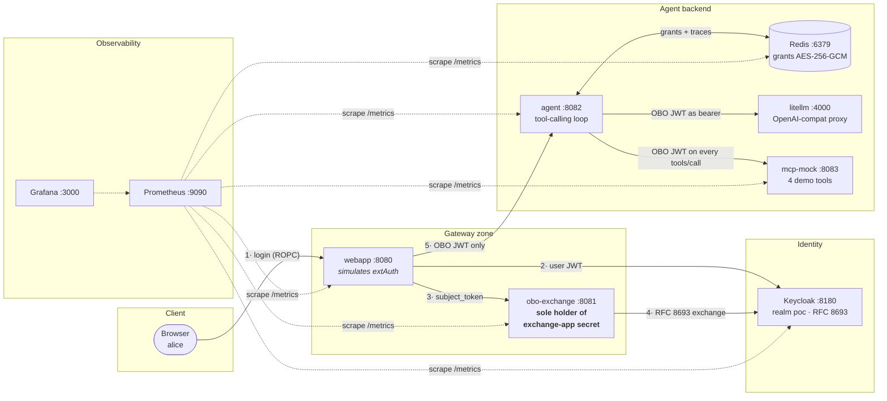
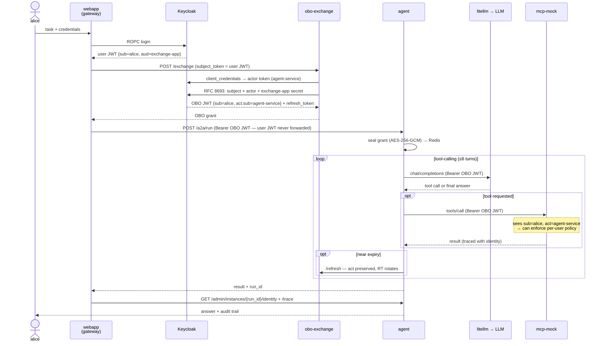

### Table of Contents

- Introduction
- The Problem: agents are anonymous proxies
- Enter RFC 8693: Token Exchange, On-Behalf-Of
- The Architecture
- The Identity Flow, Step by Step
- Token Anatomy
- Inside the JWT: Claims, Exchange Mechanics, Group-Based Permissions
- Where Authorization Actually Happens
- Observability: Watching Delegation Happen
- Security Properties
- Conclusion
- Reflections


Here we are. Everyone is wiring AI agents to real systems — Kubernetes clusters, CI pipelines, internal APIs — and almost nobody is asking the boring question first: **when the agent calls a tool, who is it?**

## Introduction

I've been playing with MCP tool servers and agentic loops for a while, and there was one thing that made me crazy: every downstream system sees the agent's service account. Always. The human who asked for the task disappears at the first hop.

So I built a small, fully local POC to answer one question: can every hop of an agentic workflow — the LLM proxy, every single MCP tool call — carry **both identities**, the human *and* the agent, in a token that's cryptographically real and independently verifiable?

Spoiler: yes. The standard has existed since 2020. It's **RFC 8693 Token Exchange**, and Keycloak speaks it out of the box.

In this article, I'll walk you through the architecture: a broker that exchanges the user's token for a delegated one, an agent that never sees the user's raw credential, and an audit trail that can finally answer *"what did alice actually do through this agent?"*

Everything runs in Docker on localhost — no cloud, no VPN, no TLS ceremony. Keycloak, a Python broker, a FastAPI agent, LiteLLM, a mock MCP server, Redis — plus Prometheus and Grafana, because a delegation chain you can't observe is a delegation chain you can't trust.

## The Problem: agents are anonymous proxies

The classic setup: alice logs into some portal, submits a task, an agent picks it up and starts calling tools with its own service-account credentials. Every MCP call arrives as:

```json
{ "sub": "agent-service" }
```

The tool server can answer *"is this agent allowed?"* — but not *"is **alice** allowed to do this **via** this agent?"* Those are very different questions:

- **Permissions**: alice can deploy to staging, bob can deploy to prod. With a shared service account, both can do everything the agent can.
- **Audit**: the action is attributed to a generic service account. Good luck with that during an incident review.
- **Revocation**: alice leaves the company, her session dies — but the agent keeps running with its own credentials, hours later.
- **Rate limiting**: per-agent quota instead of per-user quota. One noisy user starves everyone.

Could you just pass alice's access token straight to the agent? Naaaa... Now the agent holds a raw user credential, can impersonate her *fully* (not just for this task), and you've built a credential-leaking machine with a tool-calling loop attached.

## Enter RFC 8693: Token Exchange, On-Behalf-Of

**RFC 8693** defines a standard OAuth2 grant where a trusted party exchanges one token for another. In the **On-Behalf-Of (OBO)** variant, the exchange takes the user's token as *subject* and a service identity as *actor*, and mints a new JWT carrying both:

```json
{
  "sub": "8c8af53c-...",              // the human (alice)
  "act": { "sub": "agent-service" },  // the agent acting for her
  "iss": "http://localhost:8180/realms/poc"
}
```

`**sub**` = who owns the action. `**act.sub**` = who is executing it. Every downstream system that validates this token can enforce rules on both — and it's a real **RS256 JWT signed by Keycloak**, not something the gateway invented.

## The Architecture

Nine containers, all local:


| Port | Container | Role |
| ---- | ------------------ | ---------------------------------------------------------- |
| 8180 | `poc-keycloak` | Real IdP (Keycloak 24), runs the RFC 8693 exchange |
| 8081 | `poc-obo-exchange` | OBO broker — **sole holder** of the exchange client secret |
| 8082 | `poc-agent` | AI agent: tool-calling loop, grant store, audit endpoints |
| 8083 | `poc-mcp-mock` | MCP Streamable HTTP server with 4 demo tools |
| 4000 | `poc-litellm` | OpenAI-compatible LLM proxy (Ollama / OpenAI / Anthropic) |
| 8080 | `poc-webapp` | Identity-flow visualizer (simulates the gateway) |
| 6379 | `poc-redis` | Grant store, AES-256-GCM encrypted at rest |
| 9090 | `poc-prometheus` | Metrics — scrapes every service + Keycloak + Redis |
| 3000 | `poc-grafana` | Two auto-provisioned dashboards (delegation flow, service RED) |


Three Keycloak clients define the trust topology:

```
poc-webapp          public PKCE app     ← human logs in here
agent-service       service account     ← the agent's own identity (actor)
exchange-app        confidential        ← holds the skeleton key; runs RFC 8693
```

The design choice I care most about: the `exchange-app` client secret — the **skeleton key** that can mint delegated tokens for any user — lives in exactly one small, auditable service: the `obo-exchange` broker. The agent never touches it. If it isn't there, it can't leak.

### OBO the pattern vs obo-exchange the service

Two easily-confused names, worth separating:

- **OBO** is a *pattern*, not software: "On-Behalf-Of", the RFC 8693 flow where a user token is exchanged for a delegated token `{sub=user, act=agent}`. It's an OAuth2 grant type (`urn:ietf:params:oauth:grant-type:token-exchange`), and the exchange itself is performed **by Keycloak**.
- **obo-exchange** is the small application that brokers it — ~330 lines of FastAPI. It mints nothing itself; its whole job is three things: hold the `exchange-app` secret (the only container that has it), call Keycloak (`/exchange` and `/refresh`, `act` preserved), and serve `/authz` for a gateway's extAuth filter.

It's small on purpose: zero business logic means easy audit and minimal attack surface, and in Kubernetes a tight NetworkPolicy (only the gateway and the agent may reach it). You can remove the service entirely — gateway extAuth talking to Keycloak directly, or clients calling Keycloak themselves with standard token exchange v2 (Keycloak 26.2+). The dedicated broker stays the right choice when you want the secret in exactly one place and centralized audit of every exchange.

The full component map:



## The Identity Flow, Step by Step



Four things worth noticing:

1. The **user JWT stops at the gateway**. What crosses into the agent backend is only the delegated token.
2. The agent stores the grant **encrypted at rest** (AES-256-GCM in Redis), keyed by run id.
3. The OBO token is short-lived (1h) but comes with a **rotating refresh token** — the broker can renew it offline, so a long-running task survives without the human being present. The `act` claim is preserved across refreshes. One Keycloak gotcha here: when you ask the exchange for `requested_token_type=access_token`, Keycloak **omits the refresh token entirely** — the broker has to request the `refresh_token` type (with `offline_access` in scope) or long-running renewability silently doesn't exist.
4. Operator-only audit endpoints reconstruct everything after the fact:

```bash
curl http://localhost:8082/admin/instances/$RUN_ID/identity | python3 -m json.tool
curl http://localhost:8082/admin/instances/$RUN_ID/trace    | python3 -m json.tool
```

The logs alone are already worth the exercise:

```
[OBO] run=abc123 sub=8c8af53c act=agent-service has_refresh=True
[MCP] run=abc123 tools/call sub=8c8af53c act=agent-service ok=True
```

The webapp visualizes the whole chain live — login, exchange, agent run, audit — with every JWT decoded on screen. In Step 2 you can see the exchange result: same `sub` as the user token, `act.sub=agent-service`, and `iss` pointing at the realm — a real RS256 exchange performed by Keycloak, not a local shortcut (more on that below):


## Token Anatomy

User JWT, straight from Keycloak login:

```json
{
  "sub":   "8c8af53c-bcfc-4960-8874-bfb859aba5e0",
  "aud":   "exchange-app",
  "iss":   "http://localhost:8180/realms/poc",
  "email": "alice@poc.local"
}
```

OBO token, minted by Keycloak via RFC 8693:

```json
{
  "sub":   "8c8af53c-bcfc-4960-8874-bfb859aba5e0",
  "act":   { "sub": "agent-service" },
  "iss":   "http://localhost:8180/realms/poc",
  "scope": "openid profile email"
}
```

Same `sub`, same issuer, same signature chain — plus the `act` claim. Any service with the realm's public key can verify it independently. No shared secrets between tool servers and the gateway, no "trust me, it's alice" headers.

## Inside the JWT: Claims, Exchange Mechanics, Group-Based Permissions

The `sub` + `act` pair is the headline, but the rest of the token is where per-user authorization actually comes from. Let's open it up.

### Three parts, one signature

A JWT is three base64url segments joined by dots: `header.payload.signature`.

```json
// header — tells the verifier HOW to check the token
{ "alg": "RS256", "typ": "JWT", "kid": "f3a1..." }
```

The header's `kid` (key id) points at one of the realm's public keys, published at a well-known URL:

```
http://localhost:8180/realms/poc/protocol/openid-connect/certs   ← JWKS
```

The signature covers header + payload, made with Keycloak's *private* key. Anyone can fetch the JWKS and verify; only Keycloak can sign. That asymmetry is the entire trust model: the MCP server never needs a shared secret with the gateway, it needs one HTTP GET.

Two properties people mix up: a JWT is **stateless** (any service verifies it offline, no call to Keycloak) but it is **not encrypted** — it's just base64. Anyone holding the token reads every claim. Never put secrets in claims.

### The claims that matter

| Claim | Set by | What it does in this flow |
| ----- | ------ | ------------------------- |
| `iss` | Keycloak | Which realm minted it. Verifiers reject any other issuer. |
| `sub` | Keycloak | Stable user UUID — **not** the username, which can change. This is the audit anchor. |
| `aud` | Keycloak | Who the token is *for*. The user token says `exchange-app`; the OBO token can be re-audienced per resource server. Verifiers reject tokens not addressed to them. |
| `azp` | Keycloak | Which client *requested* it (authorized party). Also how the broker derives a readable actor name: the actor token's `sub` is a UUID, its `azp` is `agent-service`. |
| `exp` / `iat` | Keycloak | Lifetime. OBO tokens are short-lived (1h); long tasks live on the refresh token, not on a long `exp` — the agent refreshes when `now >= exp - 60s`. |
| `jti` | Keycloak | Unique token id — revocation lists and replay detection key on it. |
| `scope` | negotiated | What *kind* of operations the token allows (`openid profile email`, later `mcp:read` / `mcp:write`). Exchange can only **narrow** scope, never widen it. |
| `act` | RFC 8693 | The actor. Nests on repeated exchange: `act.act` records a delegation *chain* (agent A delegates to agent B — the whole lineage stays in the token). |
| `realm_access.roles` | role mappings | The user's realm roles — the input for per-tool RBAC. |
| `groups` | protocol mapper | Group membership emitted as a claim — the bridge from AD (next section). |

### What the exchange actually does with these fields

The broker's call to Keycloak, unwrapped:

```bash
curl -s http://localhost:8180/realms/poc/protocol/openid-connect/token \
  -d grant_type=urn:ietf:params:oauth:grant-type:token-exchange \
  -d client_id=exchange-app \
  -d client_secret=$EXCHANGE_SECRET \
  -d subject_token=$USER_JWT \
  -d subject_token_type=urn:ietf:params:oauth:token-type:access_token \
  -d requested_token_type=urn:ietf:params:oauth:token-type:refresh_token \
  -d audience=agent-service \
  -d scope="openid offline_access"
```

Keycloak then:

1. **Verifies the subject token** — its own signature, `exp` not passed, `iss` is itself, `aud` includes `exchange-app`. An expired or foreign user token means no exchange: delegation dies with the session.
2. **Checks the exchange permission** — `exchange-app` must be explicitly allowed to exchange toward the target client. That's the fine-grained authz permission `setup.sh` configures; without it Keycloak returns 403 regardless of the secret.
3. **Mints a new token** — `sub`, `email`, roles and groups are re-read **from the user model at mint time** (not copied blindly from the subject token — disable the user and the next exchange fails), `act` is injected from the actor identity, `aud` is rewritten, `scope` is intersected with what was requested, fresh `exp`.

That third point is subtle and important: because claims are re-derived at every exchange and refresh, revoking a role or disabling a user propagates within one token lifetime — no "the agent still has a 30-day-old token with admin roles" scenario.

### From AD group to token claim

None of this works in an enterprise unless it plugs into the directory you already have. The chain is:

```
AD / Entra ID group  →  Keycloak group  →  realm role  →  JWT claim
  "GG-Platform-Admins"    /platform-admins    platform-admin   realm_access.roles
```

Two standard ways to wire the first arrow:

- **LDAP user federation** — Keycloak reads AD directly; an *ldap group mapper* imports AD groups as Keycloak groups on sync.
- **Identity brokering** — login is delegated to Azure AD / Entra via OIDC or SAML, and the incoming `groups` claim is mapped through an *identity-provider mapper*.

Then a **group-to-role mapping** (or a plain protocol mapper emitting the `groups` claim) makes membership appear in every token — including the OBO token, because as we just saw, claims are re-read from the user model at exchange time. Alice's OBO token becomes:

```json
{
  "sub": "8c8af53c-...",
  "act": { "sub": "agent-service" },
  "groups": ["/platform-admins", "/db-readers"],
  "realm_access": { "roles": ["platform-admin", "db-reader"] }
}
```

Remove alice from `GG-Platform-Admins` in AD and — after the next directory sync + token refresh — every agent acting on her behalf loses `platform-admin`. The directory team keeps its existing workflow; the agent platform inherits it for free.

### From claims to tool permissions

Now the payoff: the MCP server (or any resource server — a DB proxy, an API gateway) reads those claims and enforces per-tool policy. A permission matrix stops being architecture and becomes a lookup:

| Tool | Requires |
| ---- | -------- |
| `query_database` (read-only) | role `db-reader` |
| `execute_sql` (write) | role `db-writer` **and** HITL approval |
| `call_billing_api` | group `/billing-team` and scope `mcp:write` |
| `delete_deployment` | role `platform-admin` |

```python
TOOL_POLICY = {
    "query_database":    {"roles": {"db-reader"}},
    "execute_sql":       {"roles": {"db-writer"}, "hitl": True},
    "call_billing_api":  {"groups": {"/billing-team"}, "scopes": {"mcp:write"}},
    "delete_deployment": {"roles": {"platform-admin"}},
}

def authorize(tool, claims):
    policy = TOOL_POLICY.get(tool, {})
    roles  = set(claims.get("realm_access", {}).get("roles", []))
    groups = set(claims.get("groups", []))
    scopes = set(claims.get("scope", "").split())
    if policy.get("roles") and not policy["roles"] & roles:
        raise PermissionError(
            f"{tool}: needs role {policy['roles']}, sub={claims['sub']} has {roles}")
    if policy.get("groups") and not policy["groups"] & groups:
        raise PermissionError(f"{tool}: needs group {policy['groups']}")
    if policy.get("scopes") and not policy["scopes"] <= scopes:
        raise PermissionError(f"{tool}: needs scope {policy['scopes']}")
    return policy.get("hitl", False)   # caller pauses for approval if True
```

Two things make this pattern stronger than app-level ACLs:

- **The same claims work everywhere.** A Postgres proxy can key row-level security on `sub`; an internal API gateway can require `groups`; the MCP server gates tools on roles. One identity, one policy language, enforced at N independent points — and every denial logs *which human*, via *which agent*, was refused *what*.
- **Per-task narrowing.** The broker can mint the OBO token with `audience=mcp-db` and `scope=mcp:read` for a reporting task, and the same user gets `mcp:write` only for a deployment task. The blast radius of a compromised agent run is the intersection of *user roles* × *task scope* × *token audience*, not the union of everything the platform can do.

> ⚠️ Corollary: anything in the chain that *ignores* the token breaks the model. An LLM response cache keyed only on the prompt would happily serve alice's cached answer to bob. If you add caching anywhere in an identity-carrying pipeline, the cache key must include `sub`.

## Where Authorization Actually Happens

Knowing *who* alice is doesn't mean she can run every tool. The token is the transport; enforcement happens at independent layers, and each one reads the same two claims:

**Layer 1 — Gateway PDP.** CEL rules on the JWT before the request touches any tool server. In production this is **agentgateway** (Envoy-based) with an extAuth filter:

```yaml
- path: /mcp
  policy: jwt.realm_access.roles.exists(r, r == "ai-platform-user")
```

**Layer 2 — MCP server per-tool checks.** The tool server receives the full OBO token and can gate sensitive tools on alice's roles:

```python
SENSITIVE_TOOLS = {"delete_deployment", "apply_terraform", "merge_pr"}

def _exec_tool(name, arguments, claims):
    if name in SENSITIVE_TOOLS:
        roles = claims.get("realm_access", {}).get("roles", [])
        if "platform-admin" not in roles:
            raise PermissionError(
                f"tool '{name}' requires platform-admin — "
                f"sub={claims['sub']} has roles={roles}"
            )
```

**Layer 3 — Scope negotiation at exchange time.** Mint the OBO token with `mcp:read` but not `mcp:write`, and the tool server refuses writes regardless of roles.

**Layer 4 — Human-in-the-Loop.** For tools that are sensitive no matter who asks, the workflow pauses, notifies the human, and resumes only on explicit approval:

```
agent wants to call: delete_namespace
↓ HITL gate: pause workflow
↓ human sees notification → approve / reject
↓ approve: tool runs — reject: LLM is told "call was rejected"
```

The end-to-end picture, when everything is on:


## Observability: Watching Delegation Happen

The first version of this POC had a problem I only saw after a critical review pass: the broker had a **fail-open** path. If Keycloak returned non-200 on the exchange — outage, misconfiguration, even an invalid subject token — the broker silently fell back to a locally-signed HMAC token that *looked* like a valid delegated token. The system degraded to a weaker trust model and nobody was forced to notice.

The fix has two halves, and the second one is the interesting one:

1. The fallback is now gated behind `ALLOW_LOCAL_FALLBACK` — `true` locally for demo ergonomics, **`false` in the Kubernetes deployment**, where a Keycloak failure means a failed exchange, full stop. Fail closed.
2. Every exchange outcome is **counted**: `obo_exchange_total{result="ok|fallback|error"}`. A security downgrade you can't measure is a security downgrade you'll discover during the incident.

Every Python service exposes `/metrics` (RED per route plus domain metrics: `agent_runs_total{status}`, `agent_mcp_requests_total{tool}`, `mcp_tool_calls_total`, `webapp_flows_total{fallback}`), `/healthz` and `/readyz`. Prometheus scrapes all seven targets — the four Python services plus Keycloak (`KC_METRICS_ENABLED=true`), Redis via `redis_exporter`, and itself — and Grafana ships two auto-provisioned dashboards:


The *Delegation Flow* dashboard is the one that matters: exchange rate, **fallback ratio** (in the screenshot it reads "No data" — zero fallback samples, which is exactly what healthy looks like; any nonzero value turns it red, meaning Keycloak stopped doing real RFC 8693 and the broker is minting demo tokens), Keycloak reachability, run outcomes, token refreshes, per-tool MCP traffic on both the agent and server side, hop latencies:


The *Service RED* dashboard covers rate / errors / duration per service, plus scrape-target availability and Redis memory — the boring one you look at when something is slow. Look at the errors panel: those `webapp 500` and `mcp-mock 500` spikes are exactly the latent defects described below, caught on camera:


### The dashboards paid for themselves within hours

This is the part I want to insist on. Four latent defects became visible that log-grepping had never surfaced:

1. **The E2E test was silently exercising the HMAC fallback on every run.** The fallback-ratio stat sat at 50% and pointed straight at it: the test passed the user JWT where the actor token belonged, and — bonus finding — dev-mode Keycloak derives the token `iss` from the request Host header, so tokens minted via `localhost:8180` get rejected as `invalid_token` by the in-network exchange at `keycloak:8080`. The test now logs in through the internal issuer and **fails** when the exchange degrades.
2. **Real RS256 grants were not renewable.** Only the fallback tokens carried a refresh token (see the Keycloak gotcha above) — the POC's core "renewability" property worked only on the degraded path. Ouch.
3. **The webapp returned 500 on agent timeout** under concurrent runs — unhandled `httpx.ReadTimeout`, now a clean 504/502.
4. **The MCP server crashed on `"params": null`** — LLM-driven JSON-RPC clients send explicit nulls, and `.get(k, {})` does not cover them.

Number 1 and 2 are the humbling ones: the system *looked* like it was demonstrating real RFC 8693 delegation, and half the time it was demonstrating a locally-signed simulation of it. No log line said so. A single red ratio stat did.

And because "it works on my laptop" is not a claim, there's a test pyramid — `./scripts/test-flow.sh`, unit → integration → E2E, 31 checks with the stack up. The key assertions: `fallback=False` on the real exchange, and the metrics counters actually incrementing after the E2E run.

## Security Properties

1. **The agent never sees the user's raw credential** — only the delegated OBO token, scoped to this task.
2. **The exchange secret is held by one small broker** — the skeleton-key pattern. Compromising the agent doesn't give you token-minting power.
3. **Grants are encrypted at rest** — AES-256-GCM in Redis; token material never sits in plaintext.
4. **Tokens are real RS256 JWTs signed by Keycloak** — verifiable by anyone with the realm public key, forgeable by no one.
5. **Every MCP call is traced with the identity it presented** — audit is a query, not an archaeology project.
6. **Revocation works** — alice's session ends, her `sub` becomes unauthorized, and in-flight tool calls fail closed.
7. **The trust downgrade path is gated and measured** — the local-token fallback is off in production (`ALLOW_LOCAL_FALLBACK=false`) and alertable via the `obo_exchange_total{result="fallback"}` metric when it's on.

## Conclusion

Agent identity is not an exotic problem requiring an exotic solution. RFC 8693 has been sitting there since 2020, Keycloak implements it, and the whole delegation chain — login, exchange, agent run, LLM call, MCP call, audit, dashboards — fits in nine containers on a laptop. When the laptop stops being enough, there's a Helm chart (`helm/agent-identity-poc`) where every component is optional and externally wireable: point it at your existing Keycloak and Redis, swap LiteLLM for your LLM gateway, and the defaults fail closed, run non-root with a read-only rootfs, and ship HPAs for the broker and the agent. The `sub` + `act` pair turns "is this agent allowed?" into "is this *user* allowed to do this *via* this agent?", which is the question your security team actually wants answered. If you're wiring agents to real infrastructure, put the identity plumbing in before the agents get interesting.

## Reflections

Intellectual honesty time: this POC demonstrates identity **transport**, not enforcement.

What is verified: the token reaching MCP really carries `sub=alice act=agent-service`, the agent never holds alice's raw token, every call is traced and now *measured*. An EA/SRE critical review pass (`docs/CRITICAL_REVIEW.md`) already forced a round of fixes: the fail-open HMAC fallback is gated and counted, the trace store is an atomic Redis list (concurrent tool calls were losing audit entries to a read-modify-write race — an audit trail that loses entries under load is worse than none, it lies), Redis is a readiness dependency (`/readyz`), so a replica that loses it stops receiving traffic instead of silently splitting state, and the broker went fully async — one slow Keycloak round-trip no longer stalls every in-flight exchange. What is still missing?

- **Downstream services don't verify the RS256 signature** — agent, MCP server and webapp decode the JWT without checking it against Keycloak's JWKS. The audit trail records *claimed* identity, not *proven* identity. This is the highest-value next increment.
- The gateway is **simulated** by the webapp — no real CEL policy on `/mcp`. Production wants agentgateway with an extAuth filter.
- The MCP server **logs** `sub` and `act` but blocks nothing. The per-tool role check above is a code sketch, not shipped behavior.
- No custom `mcp:read` / `mcp:write` scopes yet — the OBO token carries plain `openid profile email`.
- HITL is disabled (`ENABLE_HITL=0`). The durable-workflow pause/resume exists as stubs.
- Login uses ROPC (password grant) for demo simplicity — production means PKCE in a browser, plus mTLS everywhere (the refresh token travels in a custom header, which is only acceptable on a local bridge network).
- Keycloak's token exchange here is the **legacy preview** feature (`KC_FEATURES=token-exchange`); Keycloak 26.2+ ships standard v2 token exchange, which would remove most of the permission-bootstrap fragility in `setup.sh`.

Each gap is deliberate: transport first, because without `sub=alice` in the token, no enforcement layer has anything to enforce. The enforcement layers are the fun part — and they're all one `if` statement away once the identity is there.

If this topic touches your stack, you may also like [Stargate LLM Gateway]() — the production-side LLM gateway story this POC plugs into.